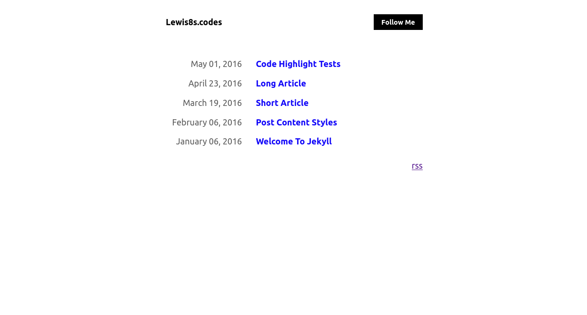

# sebasic

[](https://badge.fury.io/rb/sebasic)

Sebasic is an easy on the eyes IKEA style blog [Jekyll](https://jekyllrb.com/) for programmers. [[view demo]](https://lewis8s.codes) 

Inspired by [sgolem](https://sgolem.com/) theme, and [rauchg.com](https://rauchg.com/)



## Installation

### New Blog
If you want to create a new blog using sebasic. You can follow these steps after setting up the [Jekyll](https://jekyllrb.com) environments:

Clone this repository: 
```bash
git clone https://github.com/lewisrobbins/sebasic
```

Move into that directory:
```bash
cd sebasic/
```

Install required gems using `bundle`:
```bash
bundle install
```

Run the blog in localhost
```bash
jekyll serve
```

Once you successfully run the sebasic blog, you can modify the theme and add posts by yourself, have fun!

### Add sebasic to an Existing Blog

Add this line to your Jekyll site's `Gemfile`:

```ruby
gem "sebasic"
```

And add this line to your Jekyll site's `_config.yml`:

```yaml
theme: sebasic
```

And then execute:

    $ bundle

Or install it yourself as:

    $ gem install sebasic

### Deploy to Github Pages

:warning: If you want to publish your site in [Github Pages](https://pages.github.com/). Change `theme: xxx` in `_config.yml` to `remote_theme: lewisrobbins/sebasic` then push to your github repo (this is important, or you will get an error from github pages that not support the sebasic theme). If you want to test your site locally, you can change that to `theme: sebasic` and build again.


## Usage

You can modify the `_config.yml` to custom your blog. 

```yaml
title: sebasic
description: Test site
author: Lewis R
url: https://lewis8s.codes

sebasic:
  date_format: "%B %d, %Y"
  twitter_user: realDonaldTrump # Twitter username for 'follow me button'

theme: sebasic
```

# Build settings

## Contributing

Bug reports and pull requests are welcome on GitHub at [here](https://github.com/lewisrobbins/sebasic)

## Development

To set up your environment to develop this theme, run `bundle install`.

Your theme is setup just like a normal Jekyll site! To test your theme, run `bundle exec jekyll serve` and open your browser at `http://localhost:4000`. This starts a Jekyll server using your theme. Add pages, documents, data, etc. like normal to test your theme's contents. As you make modifications to your theme and to your content, your site will regenerate and you should see the changes in the browser after a refresh, just like normal.

When your theme is released, only the files in `_layouts`, `_includes`, `_sass` and `assets` tracked with Git will be bundled.
To add a custom directory to your theme-gem, please edit the regexp in `sebasic.gemspec` accordingly.

## License

The theme is available as open source under the terms of the [MIT License](https://opensource.org/licenses/MIT).

